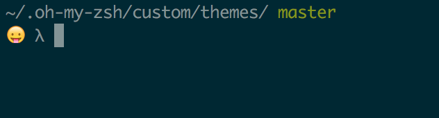

# lamb-moji

Yet another oh-my-zsh theme

The emoji will random in each new session.

## Why
I wanna a dead simple theme like [lambda](https://github.com/robbyrussell/oh-my-zsh/blob/master/themes/lambda.zsh-theme), and [a random emoji](https://gist.github.com/oshybystyi/2c30543cd48b2c9ecab0) 4 fun ~

## Usage
Follow the *oh my zsh* official instruction - [Customization#overriding-and-adding-themes](https://github.com/robbyrussell/oh-my-zsh/wiki/Customization#overriding-and-adding-themes) :beer:

## Tips
You can customize your preffered emoji.

1. Edit the `EMOJI` variable in the [lamb-moji.zsh-theme](./lamb-moji.zsh-theme) file
2. Hit `Command + Ctrl + Space` to open emoji panel and select

## Acknowledgement
- [lambda.zsh-theme](https://github.com/robbyrussell/oh-my-zsh/blob/master/themes/lambda.zsh-theme)
- [random-emoji.zsh-theme](https://gist.github.com/oshybystyi/2c30543cd48b2c9ecab0)

## Lisence
MIT